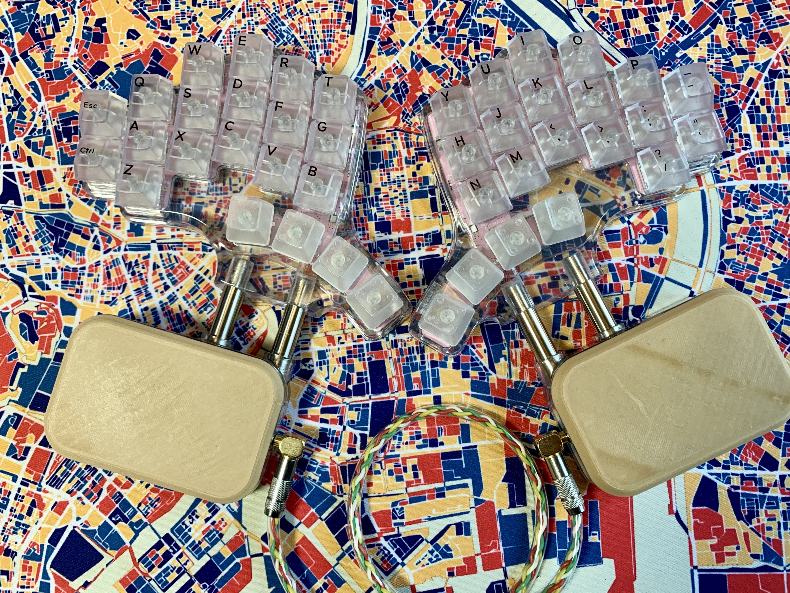

# Project 🦣

This keyboard was developed as a successor to the elephant42 and was originally planned to be released as mammoth42. However, during the development process, custom keyboards by other authors, Mammoth75 and Mammoth20, were released, and it seemed somewhat awkward to re-release the keyboard under the same name.
However, we could not give up our desire to use 🦣 as a companion to 🐘, so we decided to give it this name, taking care not to infringe on their names as much as possible.

## Still WIP, or Forever WIP?

This project is still in its infancy and is only about 20% of the way to the final product I have in mind. There are still a lot of unresolved bugs and issues, but even at this point, I think the keyboard is fun enough to use. Let's enjoy "being unfinished" together.

### Rough Milestones

1. [x] Works as USB HID with Pro Micro or as BLE HID with ISP1807micro and CR2032 battery.
1. [ ] Operation as a left and right independent BLE device. The board might be modified to use Seeed XIAO BLE and the batteries might be modified to use NiMH rechargeable batteries.
1. [ ] Support for 34mm trackball.
1. (Still a secret.)

    :

### Do not manufacture yet unless you must!

The design is currently designed to use two MCP23017-E/SS. This I/O expander has long since been depleted from the market and is currently priced at two or three times its normal price.
To protect your wallet, it would be wise not to use the current design.

####  ⚠️⚠️⚠️⚠️⚠️⚠️⚠️⚠️⚠️⚠️ Known Issues ⚠️⚠️⚠️⚠️⚠️⚠️⚠️⚠️⚠️⚠️

* Diode footprint is so small that 1N4148W just barely does not fit.
* HT7733A is poorly positioned and gets in the way of cable routing
* 3D model of palm rest needs to be updated before lid can be tightened
* The logo icon is still the same as elephant42, and it should be redesigned.
* ↑ Should these be managed as Issues, right? I need to get used to Github.

## Where's the firmware?

Not yet. It would be boring to use an existing keyboard firmware framework, so I would like to write one from scratch in Rust.

## License?

Beerware!!

Come drink beer in Tokyo with me!! 🍺🍺🍺

## Poor English?

Sorry, it's DeepL Translate.
