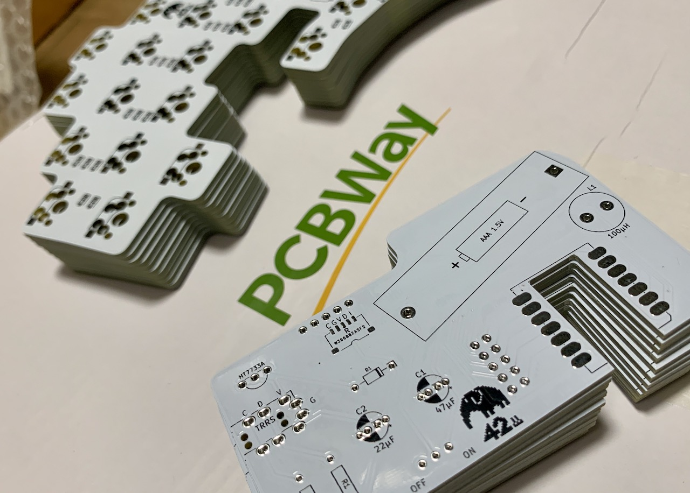

# Project 🦣

This keyboard was developed as a successor to the elephant42 and was originally planned to be released as mammoth42. However, during the development process, custom keyboards by other authors, Mammoth75 and Mammoth20, were released, and it seemed somewhat awkward to re-release the keyboard under the same name.
However, we could not give up our desire to use 🦣 as a companion to 🐘, so we decided to give it this name, taking care not to infringe on their names as much as possible.

# Still WIP, or Forever WIP?

This project is still in its infancy and is only about 20% of the way to the final product I have in mind. There are still a lot of unresolved bugs and issues, but even at this point, I think the keyboard is fun enough to use. Let's enjoy "being unfinished" together.

## Rough Milestones

1. [x] Works as USB HID with Pro Micro or as BLE HID with ISP1807micro and CR2032 battery.
1. [x] Operation as a left and right independent BLE device. The board might be modified to use Seeed XIAO BLE and the batteries might be modified to use NiMH rechargeable batteries.
1. [ ] Support for 34mm trackball.
1. (Still a secret.)

    :

## To be confirmed before manufacturing

The design currently uses two MCP23017-E/SS. These I/O expanders have long since been depleted from the market due to the recent semiconductor shortage and are currently priced at two to three times the normal price. To protect your wallet, it would be wise to wait for the stock to come back.

# BOM

## Main Boards

|Ref|Qty|Value or Part|Description|
|--|--|--|--|
||42|1N4148W|Fast Switching Diode|
||42|CPG151101S11-16|Kailh Switch Socket|
|U1,U2|2|MCP23017-E/SS|16-Bit I/O Expander|
||2|BM05B-ACHSS-A-GAN-ETF(LF)(SN)|JST ACH Connector 5P|

## Palm-rest Boards

|Ref|Qty|Value or Part|Description|
|--|--|--|--|
||2|BH-411-4P24|AAA Battery Holder|
||2|BM05B-ACHSS-A-GAN-ETF(LF)(SN)|JST ACH Connector 5P|
||2|SS-12D00G3|Slide Switch|
||2|Seeed Studio XIAO nRF52840||
|L1|2|100μH|Inductor|
|R1,R2|4|4.6kΩ|Resistor|
|C1|2|47μF|Capacitor|
|C2|2|22μF|Capacitor|
|D1|2|1S4|Schotky barrier diode|
|HT7733A|2|HT7733A|PFM Step-up DC/DC Converter|
|TRRS|0|MJ-4PP-9|TRRS Jack (Optional:2)|

## Cables

|Qty|Value or Part|Description|
|--|--|--|
|4|ACHR-05V-A-S|JST ACH Connector Housing 5P|
|10|01SACHSACH-30L-150|JST ACH Connector Contact(SACH-003G-P0.2) Cable|

# Where's the firmware?

Not yet.

# License?

Beerware!!

Come drink beer in Tokyo with me!! 🍺🍺🍺

# Poor English?

Sorry, it's DeepL Translate.

# [PR] Sponsored by PCBWay

Project 🦣 is currently prototyping with support from PCBWay (https://www.pcbway.com/).
We found the silks to be more accurate and beautiful than those of various PCB makers in the same price range.

If you are in doubt about which PCB manufacturer to manufacture, PCBWay, with its experience in manufacturing 🦣, may be a good choice.

 

Thanks a lot PCBWay!
